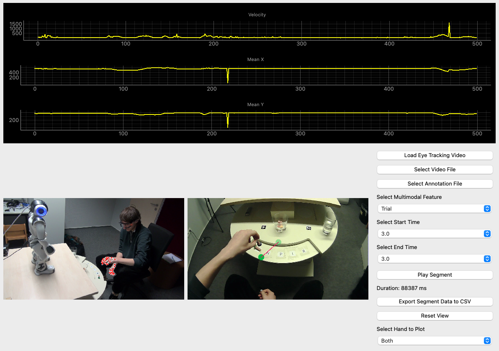

**WinGaze** is a Rerun- and PyQt5-based application that enables the alignment of online multimodal signals (gaze and pose) from multiple camera views and through remote/mobile eye trackers within multiparty interactional studies involving human-human or human-robot interactions.
The tool also allows visualization of specific times of interest and exports CSV files for further analysis.
It aims to integrate qualitative annotations (e.g., ELAN) with synchronized video playback and performs real-time pose tracking and gaze estimation to provide real-time plots and video playback.


## 🎬 Screenshots
<div align="center">
  
</div>

---

## 🔧 Installation
📌 **Python 3.9+ recommended**

1️⃣ Clone this repository:
```bash
git clone https://github.com/yourusername/WinGaze.git
cd WinGaze
pip install -r requirements.txt
```

2️⃣ Run the application:
```bash
python WinGaze.py
```

The Rerun viewer will open in a separate window to display the video panels and hand-metric time series.

---

## Project Structure
```
WinGaze/
  src/
    config/    # App and rerun settings
    core/      # Hand tracking and core data types
    data_io/   # ELAN readers and CSV export
    ui/        # PyQt5 window and controls
    utils/     # Qt helper utilities
    vis/       # Rerun logging and layouts
  WinGaze.py   # Entry point wrapper
```


## Publication

Singh, A., Wrede, B., Birte, R., Groß, A., & Rohlfing, K. J. (2025). "Manners Matter: Action history guides attention and repair choices during interaction." *IEEE International Conference on Development and Learning*. https://doi.org/10.1109/ICDL63968.2025.11204385
